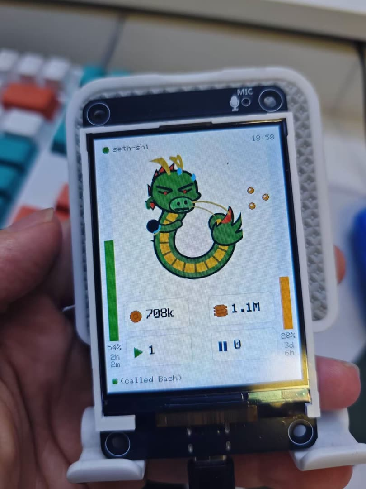
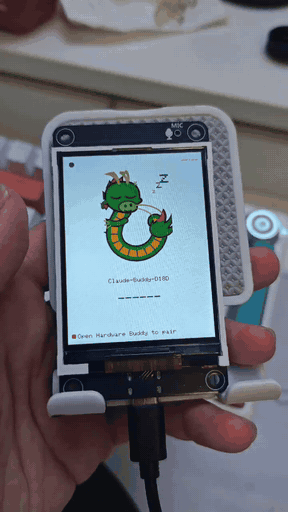

# Claude Hardware Buddy · Shenron Firmware

**English** | [中文](README.zh-CN.md)

Put an animated **Chinese dragon (Shenron)** on your desk that shows your live Claude activity:

- 🐉 **Session heartbeat** — the Claude desktop app connects over BLE and tells the device what's running, how many tokens you've used, and whether something is waiting on a permission prompt. The dragon changes pose to match.
- 📊 **Subscription quota** — a small local Go program pushes your 5-hour and 7-day usage windows to the device over USB serial, drawn as the two side bars.

Runs on an ESP32-S3 board (**ES3N28P**) with a 240×320 ILI9341 display. Sessions travel over BLE, quota over USB serial — two independent channels that work at the same time.

> This repo is a custom firmware implementation of the [Claude Hardware Buddy BLE protocol](REFERENCE.md), reskinned with a dragon theme and extended with subscription-quota display. The protocol itself is independent of this repo — anything that can advertise the Nordic UART Service can implement it.

---

## 📸 Demo

<p align="center">
  
  &nbsp;&nbsp;
  
</p>

---

## ✨ Features

- **Dragon state animation**: sleeping (disconnected) / idle / busy (multiple sessions generating) / attention (waiting on your approval) / celebrating (task done)
- **Side quota bars**: 5h + 7d windows; the reset countdown sits **above** each bar (`2h`/`30m`, or `3d`/`6h` at day scale), the remaining percentage **below**; the bar turns dragon-gold when `< 50%` remains, and hides entirely (background only) when no data has arrived
- **Owner name** up top + a 2×2 grid of info cards (token usage, session count, and other live stats)
- **Secure BLE pairing**: LE Secure Connections + 6-digit passkey bonding, AES-CCM encrypted link, no re-pairing on reconnect
- **Permission prompts**: when the desktop app sends a permission request, the dragon enters the "attention" state (device-side response logic per the protocol)

---

## 🧰 Hardware (ES3N28P)

| Part | Model / spec |
| --- | --- |
| MCU | ESP32-S3-N16R8 (16 MB flash + 8 MB OPI PSRAM) |
| Display | ILI9341 240×320, SPI2 @ 40 MHz |
| Touch | FT6336G capacitive touch (on board, not yet used by the firmware) |
| Power / serial | Native USB-Serial-JTAG (COM3) |

**Pins** (see [`src/display.h`](src/display.h)): `SCLK 12` · `MOSI 11` · `MISO 13` · `CS 10` · `DC 46` · `RST = EN (software reset)` · backlight `GPIO45` (PWM, active-high).

---

## 📁 Repository layout

```
platformio.ini          Firmware build config (env: es3n28p)
src/
  main.cpp              Main loop: BLE + serial polling, two-tier redraw (anti-flicker)
  display.h             LovyanGFX / ILI9341 pins & orientation
  theme.h               Colors
  sprites.h             Dragon sprites (RGB565)
  ui.h                  Home screen (dragon / info cards / quota bars / passkey)
  protocol.h            JSON protocol parsing (heartbeat + quota + pairing handshake)
  ble_bridge.{h,cpp}    Bluedroid NUS + secure bonding
tools/usage-bridge/     Usage bridge (Go — pushes subscription quota to serial)
REFERENCE.md            Full BLE wire-protocol documentation
```

---

## 🔧 Firmware: build & flash

Prerequisites: VS Code + the [PlatformIO](https://platformio.org/) extension (or the `pio` CLI). The first build downloads the espressif32 toolchain; behind a restricted network, set a proxy first:

```powershell
$env:HTTPS_PROXY = "http://127.0.0.1:7897"   # your proxy port
```

Plug the board in via USB (enumerates as COM3), then build + flash:

```bash
pio run -e es3n28p -t upload
```

View the serial log:

```bash
pio device monitor -e es3n28p      # 115200, native USB-Serial-JTAG
```

---

## 📡 Usage bridge `tools/usage-bridge`

A self-contained little program: it reads the OAuth token the Claude CLI already stored, queries your subscription usage, and writes one JSON line to the device's serial port every 5 minutes to fill the two side bars. It's an **independent channel** from BLE, so it happily runs alongside the desktop app.

### Prerequisites

1. Log in to the CLI with your subscription: `claude auth login` (must be a full-scope token; `setup-token` returns 401)
2. Reachable Anthropic API — **a proxy is required in mainland China** (Anthropic returns `403 Request not allowed` to CN IPs)

### Build

```bash
cd tools/usage-bridge
# Windows
GOTOOLCHAIN=local go build -o claude-buddy-usage.exe .
# macOS / Linux
GOTOOLCHAIN=local go build -o claude-buddy-usage .
```

> Dependencies are pinned to `go.bug.st/serial v1.6.2` + `go 1.24`. Build with the local toolchain (`GOTOOLCHAIN=local`) so it doesn't auto-upgrade to 1.25 (which breaks the build).

### Commands

> ⚠️ Go's flag parser stops at the first positional argument, so `--port`/`--proxy` etc. **must come before the subcommand**: `claude-buddy-usage --port COM3 enable`.

| Command | What it does |
| --- | --- |
| `claude-buddy-usage` (no subcommand) | **Run for real**: fetch quota → push to serial every 300s (loops) |
| `... test` | Fetch quota and print it, no serial. Verifies fetch/parse |
| `... ports` | List available serial ports |
| `... serialtest` | No token needed — hold the port open and push fake quota every 5s. Verifies host→serial→device |
| `... refresh` | Manually trigger one CLI token refresh |
| `... enable` | **Install auto-start** (below) and start it in the background now |
| `... disable` | Remove auto-start + stop |
| `... status` | Show whether auto-start is installed and the process is running |

**Flags**: `--port <COM3 / /dev/tty…>` · `--proxy <url>` · `--interval <sec, default 300>` · `--once` (push once and exit) · `--token <t>`.

### Running it

```bash
# With a proxy where needed; --proxy is applied to this process AND the claude child it spawns
./claude-buddy-usage --port COM3 --proxy http://127.0.0.1:7897
```

### Auto-start at login (recommended)

One command installs it as a login service that runs hidden in the background and restarts itself if it dies:

```bash
./claude-buddy-usage --port COM3 --proxy http://127.0.0.1:7897 enable
```

| Platform | Mechanism |
| --- | --- |
| **macOS** | launchd LaunchAgent (`~/Library/LaunchAgents/com.claudebuddy.usage.plist`, `RunAtLoad` + `KeepAlive` auto-restart) |
| **Windows** | Login entry in the registry (`HKCU\…\Run`, no admin required; runs windowless) |
| **Linux** | Prints guidance to create a systemd user service |

Logs go to `~/.claude-buddy-usage.log`. Manage it with:

```bash
claude-buddy-usage status      # installed? process running?
claude-buddy-usage disable     # uninstall
```

- **Harmless when the device isn't plugged in**: the `run` loop just retries opening the port every ~10s; plug the device in and the next cycle picks it up. It never crashes.
- **Stopping / uninstalling resets the device once** (closing the port drops DTR → the ESP32-S3 auto-resets) — this is expected; the bars refill on the next push after reconnect.

### How it works

1. Read the OAuth token from `~/.claude/.credentials.json` → `GET /api/oauth/usage` → parse the 5h/7d remaining % + reset time → write `{"rem5":..,"sec5":..,"rem7":..,"sec7":..}` to serial.
2. **Token refresh is delegated to the CLI**: Anthropic's edge blocks direct calls to the token endpoint, so when the token expires (401) the program runs one cheap `claude -p` (Haiku) to make the CLI refresh the token, then re-reads and retries.
3. **DTR/RTS must be asserted** for the device to receive data (the ESP32-S3 USB-Serial-JTAG uses DTR as a "host present" flag) — the program handles this when it opens the port.

---

## 🔗 Pairing with the desktop app

The BLE bridge is off by default. Enable it in Claude for macOS / Windows:

1. **Help → Troubleshooting → Enable Developer Mode**
2. **Developer → Open Hardware Buddy…**
3. **Connect**, pick your `Claude-Buddy-XXXX` from the scan list, and confirm the 6-digit passkey shown on the display

Once paired it auto-reconnects in the background; you only need the window open for initial pairing or the stats panel. Full steps and wire protocol are in **[REFERENCE.md](REFERENCE.md)**.

---

## 📝 Protocol at a glance

The device parses newline-delimited UTF-8 JSON:

- **Heartbeat** (BLE, desktop app): `total` / `running` / `waiting` / `tokens` / `tokens_today` / `msg` / `prompt` …
- **Quota** (USB serial, this bridge): `rem5` / `sec5` / `rem7` / `sec7`
- **Handshake**: `{"cmd":"status|owner|unpair"}` → ack; `{"time":[epoch,tz]}` time sync; `{"cmd":"permission",…}` permission decisions

Full field tables, permission decisions, folder push, and secure-bonding details are in **[REFERENCE.md](REFERENCE.md)**.

---

## Credits

- BLE protocol & reference: Claude Hardware Buddy (Anthropic — aimed at makers, not an officially supported feature)
- Display: [LovyanGFX](https://github.com/lovyan03/LovyanGFX) · JSON: [ArduinoJson](https://arduinojson.org/) · Serial: [go.bug.st/serial](https://github.com/bugst/go-serial)
